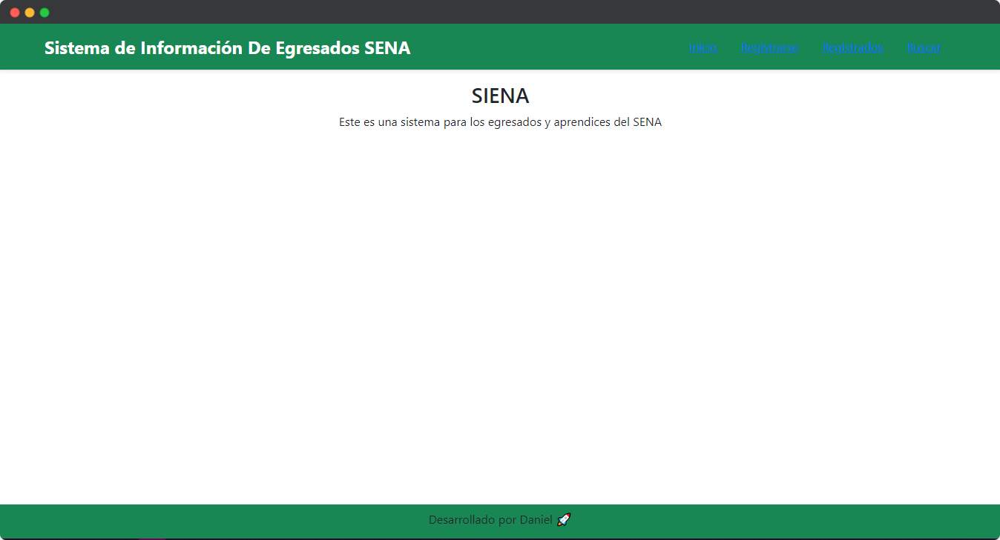
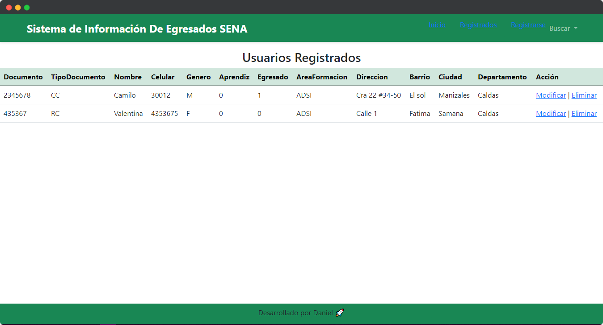
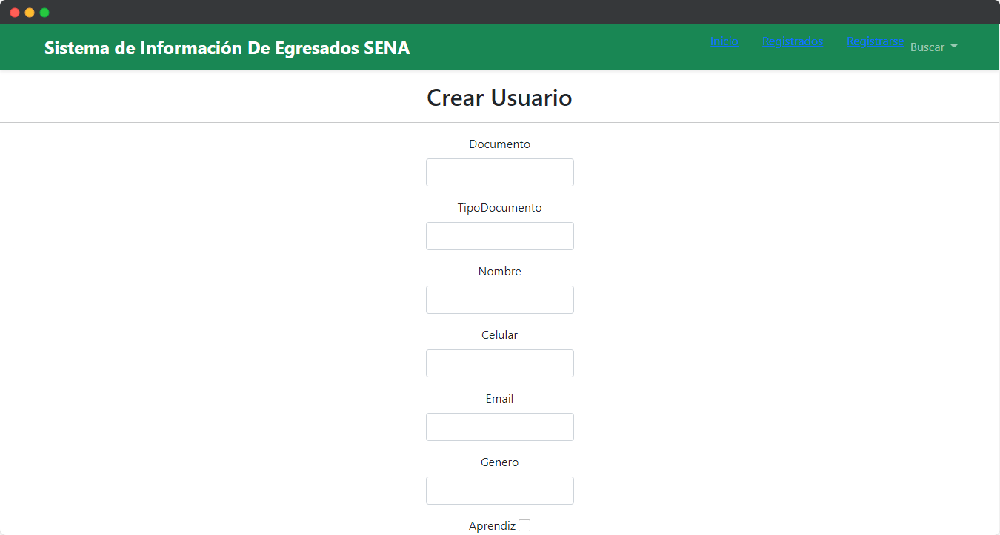
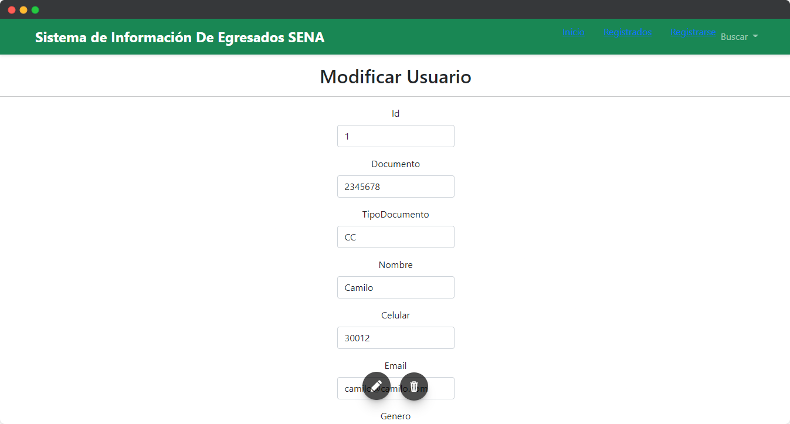
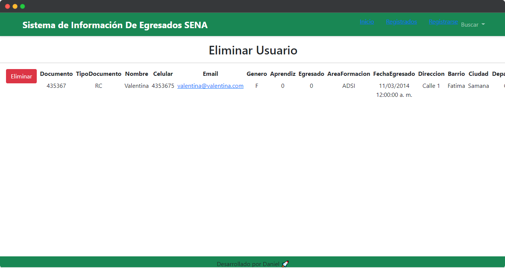
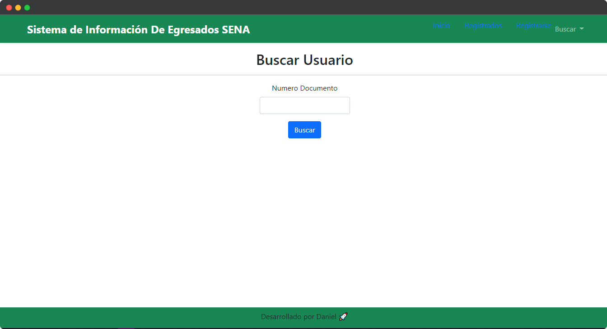

# Sistema de información egresados SENA

Esta es una aplicación para egresados del SENA donde incorporamos varias metodologías de desarrollo como y lo son: Plantillas de vistas y validación de datos de los formulario.

## Tecnologías utilizadas

- Asp.net
- MVC
- Sql Server

## Vistas del proyecto

### Inicio

### Usuarios Registrados

### Crear Usuario

### Modificar Usuario

### Eliminar Usuario

### Buscar Usuarios

